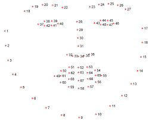

# Real-Time Gaze Tracker using Python

## Description
This project implements a real-time gaze tracker using Python, leveraging computer vision and machine learning techniques to track eye movements and determine gaze direction. The system captures user eye positions from a camera feed and processes the data to provide real-time gaze tracking, enabling applications such as hands-free interaction, accessibility features, and human-computer interaction studies.

## Features
- Real-time eye tracking using camera input
- Eye detection and landmark localization
- Gaze direction estimation using machine learning models
- Compatibility with multiple camera devices

## Technologies Used
- **Python** (Programming Language)
- **OpenCV** (For computer vision tasks)
- **Dlib** (For facial landmarks detection)
- **TensorFlow / PyTorch** (For gaze estimation models)
- **NumPy** (For numerical computation)

## Prerequisites
- Python 3.x
- Camera (external or built-in)
- OpenCV and Dlib libraries (can be installed via `pip install opencv-python dlib`)
## Screenshot

